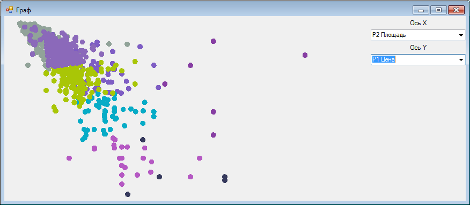

# ИАДиП 2017 Архиреев Солдаткин
Первым шагом при проведении исследования является загрузка исходных данных. Для этого в главном меню необходимо выбрать "Загрузить". Главное меню представлено на рисунке ниже:

После этого необходимо выбрать файл с исходными данными:

После того как файл был выбран, необходимо нажать "Кластеризация" в главном меню. После завершения процесса кластеризации можно посмотреть её результаты. Кнопка "Все данные" показывает разделение объектов по кластерам и центры кластеров.

Кнопка "Сводка" показывает данные по каждому из кластеров и таблицу с лингвистическими оценками.

Функция "Граф" позволяет визуально оценить результаты кластеризации. При построении графа есть возможность изменять отображаемые значения по осям.

Для выполнения оценки апартамента необходимо нажать "Оценить". После этого необходимо ввести стоимость в появившемся окне.

После этого необходимо нажать "Найти". В результате будет выведена информация по подобранному кластеру, который оказался ближе всего к заданной цене. В окне содержится информация о центре кластера, а также точечные и интервальные оценки параметров апартамента.

# Ограничения:
* Загрузке подлежат файлы .tsv
Пример входного файла: https://github.com/RikkiRu/iadip_apartments_kmeans/blob/master/iadip/iadip/SourceFile.tsv
* Программа требует файл Localization.txt рядом с исполняемым файлом .exe
